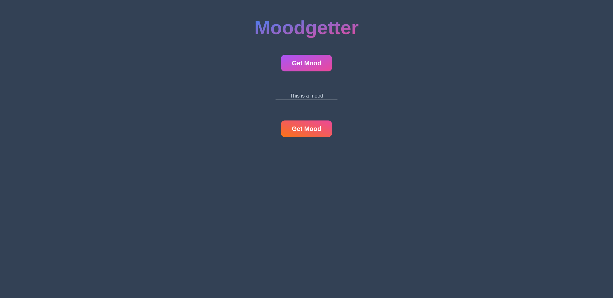

# Basic Dapp
This is a basic Dapp that I am creating to help learn web3 development. This app will allow someone to set a variable and recieve it back.
***Note: As of right now, I cannot connect to metamask because I cannot access the window object and cannot figure out how to get it to work***

## Made With
- solidity
- svelte
- tailwindcss